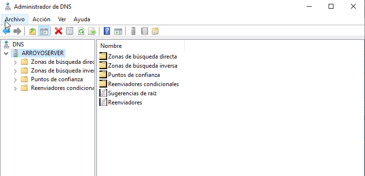
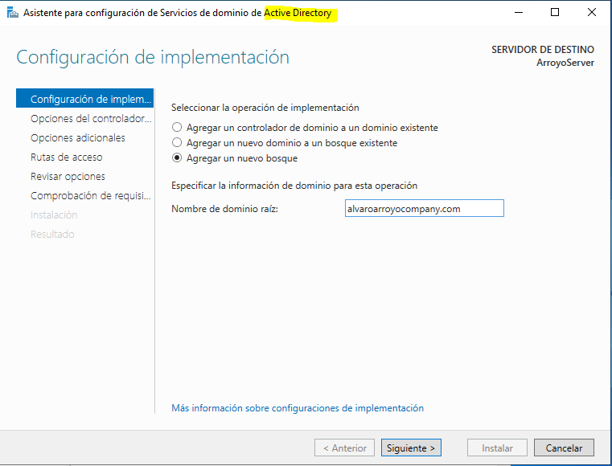

# Windows Server 2022 Deployment Demo

Practical setup of a secure Windows Server environment with DNS, AD, IIS, VPN, and PowerShell automation.

## Introduction
This project demonstrates my skills in configuring Windows Server 2022 for small-medium businesses, including DNS zones, Active Directory, VPN, a website via IIS, and user automation scripts.

## Prerequisites
- Windows Server 2022 VM (VirtualBox, 2GB RAM assigned)
- Active Directory Domain Services installed

## Step-by-Step Configuration
### 1. DNS Setup
Configured forward and reverse lookup zones for `alvaroarroyocompany.com`.
  <!-- Embed imagen -->
  <!-- Embed imagen -->
  <!-- Embed imagen -->

In turn, the host (www.) was also configured.
  <!-- Embed imagen -->

### 2. IIS Website
Hosted a simple website under the domain.

  <!-- Embed imagen -->
  <!-- Embed imagen -->
  <!-- Embed imagen -->

### 3. Domain and AD Setup
Created domain `alvaroarroyocompany.com` and OU `Employees`. Added users and GPO for password policies.

  <!-- Embed imagen -->
  <!-- Embed imagen -->
  <!-- Embed imagen -->
  <!-- Embed imagen -->

The policy implemented was based on preventing users within the domain from accessing the Windows “Run” function (W+R).
  <!-- Embed imagen -->
  <!-- Embed imagen -->
  <!-- Embed imagen -->
  <!-- Embed imagen -->

### 4. VPN Configuration
Set up VPN for remote access.
  <!-- Embed imagen -->
  <!-- Embed imagen -->

A pre-shared key is also assigned, which is used to authenticate the 
IPSec connection between the client and the server before the 
VPN tunnel is established. All clients connecting to the VPN must have 
this same key configured on their client, otherwise the connection will be 
rejected.

  <!-- Embed imagen -->

In addition, an IP address range was added that the server will dynamically assign to clients connecting via VPN. These are internal IPs, as if the client were within the local network, and therefore they are not public. 

  <!-- Embed imagen -->

### 5. PowerShell Automation
Scripts for user creation. View [Single User Script](scripts/CreateUser.ps1) and [CSV Script](scripts/CreateUsersScript.ps1).
These scripts, especially CSV, help create users in bulk in the asset directory.

## Conclusion
This lab demonstrates the ability to configure a functional Windows Server 2022 environment, integrating key services such as DNS with forward and reverse zones, Active Directory with a custom OU (Employees), a website using IIS, a VPN for remote access, and group policies (GPO) for basic security. Automation with PowerShell scripts to create users individually and in bulk using CSV reflects a practical approach to efficient server management. Despite initial challenges related to permissions and AD configuration, resolving these issues through troubleshooting and permission adjustments validates the ability to diagnose and correct errors in real environments. This project not only meets the basic requirements for small business environments, but also lays the foundation for future enhancements, such as firewall rules or security audits, providing a solid starting point for freelance work in system administration.
